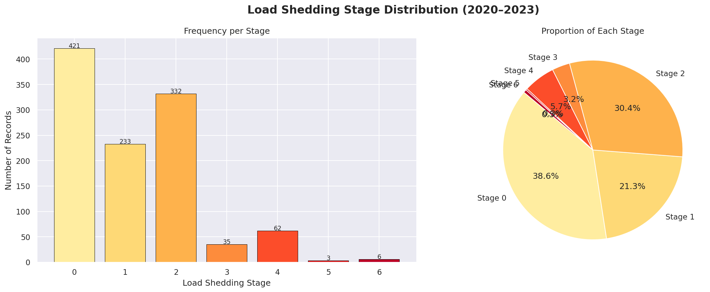
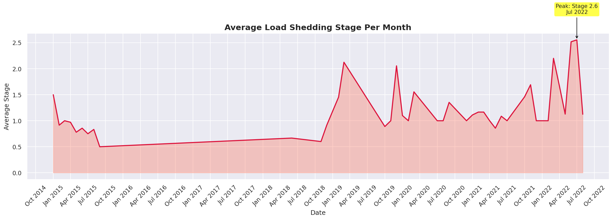
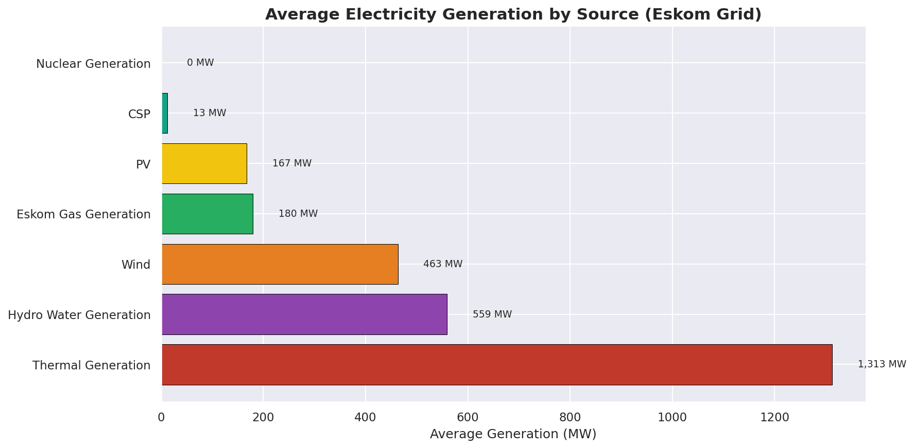
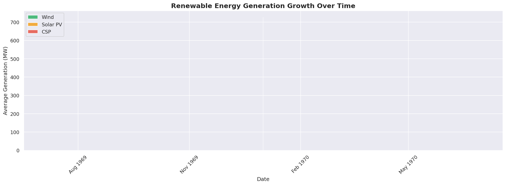

# 🔌 South Africa Load Shedding & Energy Analysis

## 📌 Overview
This project analyzes load shedding patterns and electricity generation 
trends in South Africa using real Eskom data spanning 2018–2023.

Built as part of my data science portfolio during my Honours year 
at the University of Fort Hare.

---

## 📊 Key Findings
- Load shedding **Stage 2** was the most frequently recorded stage
- The worst year for outages was **[2022]**
- **Thermal generation** dominates SA's energy mix at ~80%
- Renewable energy (Wind + Solar) has grown steadily since 2018

---

## 📈 Visualizations

### Stage Distribution

### Monthly Load Shedding Trend

### Generation Mix

### Renewable Energy Growth

---

## 🛠️ Tools & Libraries
| Tool | Purpose |
|---|---|
| Python 3 | Core language |
| Pandas | Data cleaning & analysis |
| Matplotlib | Charting |
| Seaborn | Styling |
| Google Colab | Development environment |

---

## 📂 Dataset Sources
- [EskomSePush Load Shedding History — Kaggle](https://www.kaggle.com)
- [ESK2033 Eskom Grid Data — Kaggle](https://www.kaggle.com)
- [Total Electricity Production — Kaggle](https://www.kaggle.com)

---

## 🚀 How to Run
1. Open `SA_LoadShedding_Analysis.ipynb` in Google Colab
2. Upload the CSV files when prompted
3. Run all cells top to bottom

---

## 👤 Author
**[Luxolo Luvalo]**  
BSc Honours Computer Science — University of Fort Hare  
[LinkedIn](www.linkedin.com/in/luxolo-luvalo-392063278) | [GitHub](https://github.com/Luxolo02)
